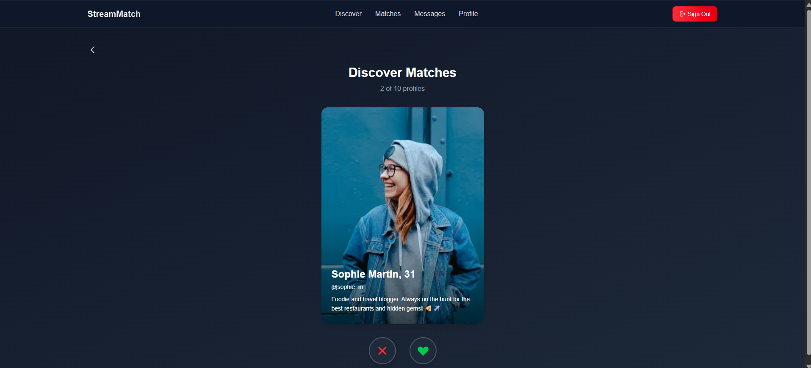
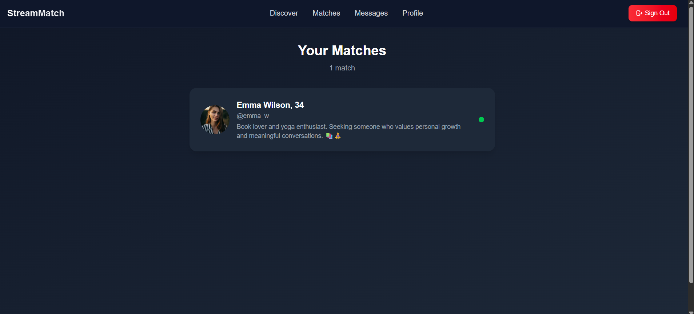
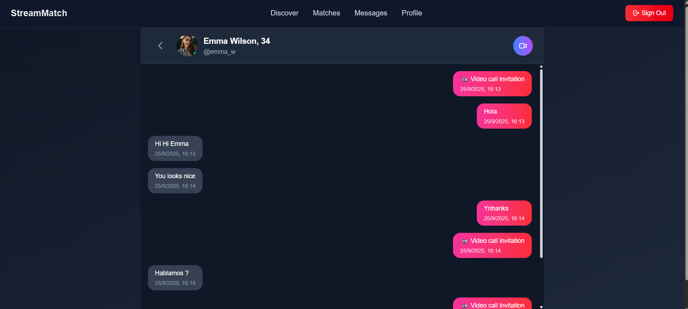
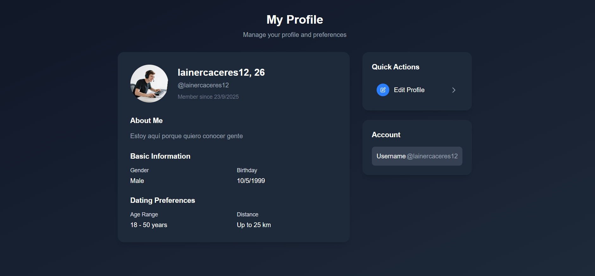

# StreamChat

A clone application built with Next.js 15, Supabase, and Stream, featuring real-time chat, user authentication, and cloud data management, delivering an interactive and scalable experience similar to modern messaging apps.

## 📸 Preview






## Getting Started

First, clone this repository:

```npm run dev
git clone git@github.com:Lainercaceres11/dating-app-with-next.git
```

Second, navigate folder:

```cd dating-app
cd dating-app
```

Third, install dependencies:

```npm install
npm install
```

Run the development server:

```npm run dev
# or
yarn dev
# or
pnpm dev
# or
bun dev
```

Open http://localhost:3000 with your browser to see the result.

You can start editing the page by modifying app/page.js. The page auto-updates as you edit the file.

## 🔑 Environment Variables

To run this project, you will need to add the following environment variables to your .env file

```env
NEXT_PUBLIC_SUPABASE_URL=
NEXT_PUBLIC_SUPABASE_PUBLISHABLE_KEY=
SUPABASE_SERVICE_ROLE_KEY=
NEXT_PUBLIC_STREAM_API_KEY=
STREAM_API_SECRET=

## 👨‍💻 Author

https://github.com/Lainercaceres11


```
